# Refactor Monolith to Microservices

## Docker hub repositories
- [Frontend](https://hub.docker.com/r/fgaviria/udagram-image-frontend)
- [Reverse-proxy](https://hub.docker.com/r/fgaviria/udagram-image-reverse-proxy)
- [User](https://hub.docker.com/r/fgaviria/udagram-image-user)
- [Feed](https://hub.docker.com/r/fgaviria/udagram-image-feed)
- [Image-filter](https://hub.docker.com/r/fgaviria/udagram-image-filter)

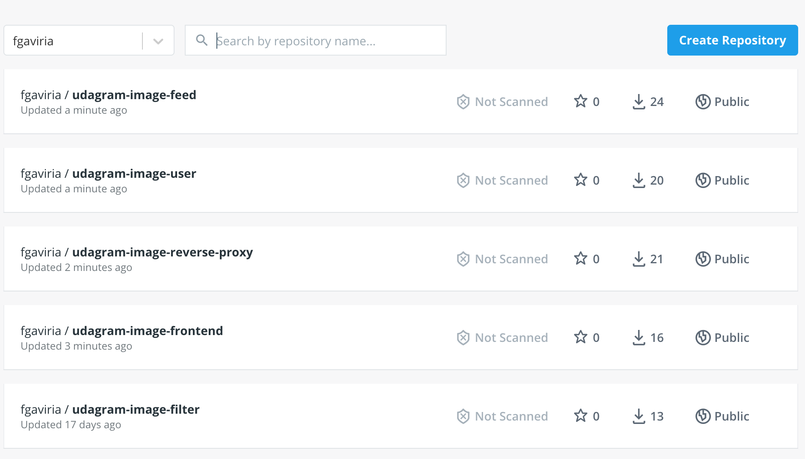

*******

## Github repositories
- [Frontend repository](https://github.com/PachoJGaviria/udagram-image-frontend)
- [Reverse-proxy repository](https://github.com/PachoJGaviria/udagram-image-reverse-proxy)
- [User repository](https://github.com/PachoJGaviria/udagram-image-user)
- [Feed repository](https://github.com/PachoJGaviria/udagram-image-feed)
- [Image-filter repository](https://github.com/PachoJGaviria/udagram-image-filter)

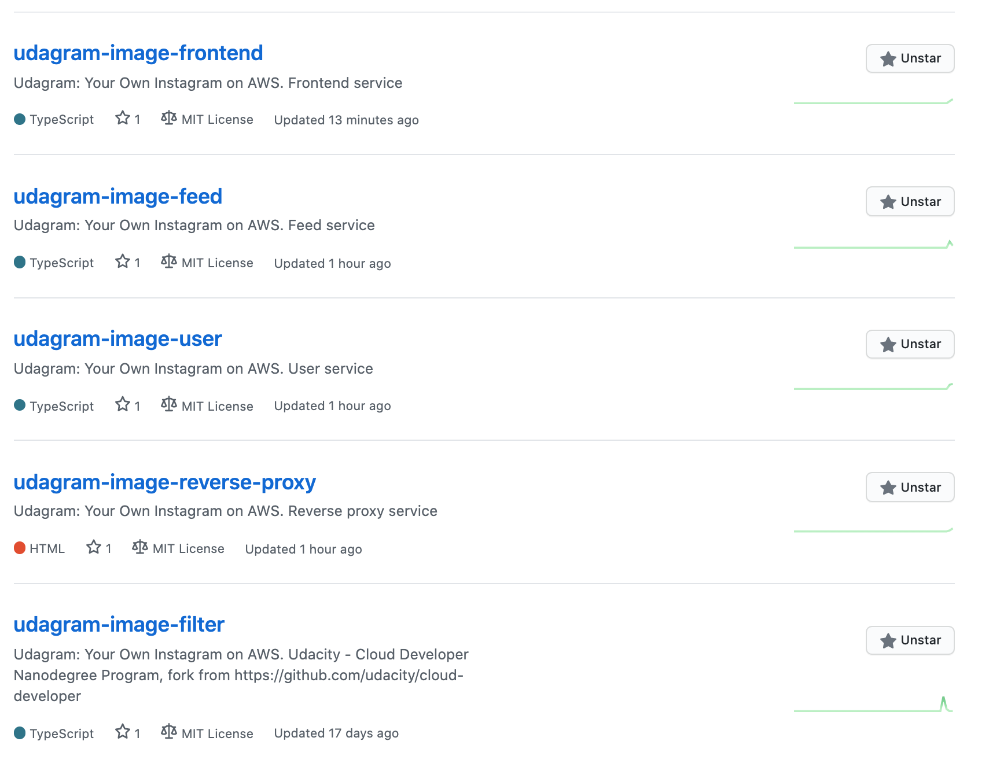

*******

## Travis CI

- [Frontend branches](https://travis-ci.com/github/PachoJGaviria/udagram-image-frontend/branches)
- [Reverse-proxy branches](https://travis-ci.com/github/PachoJGaviria/udagram-image-reverse-proxy/branches)
- [User branches](https://travis-ci.com/github/PachoJGaviria/udagram-image-user/branches)
- [Feed branches](https://travis-ci.com/github/PachoJGaviria/udagram-image-feed/branches)
- [Image-filter branches](https://travis-ci.com/github/PachoJGaviria/udagram-image-filter/branches)

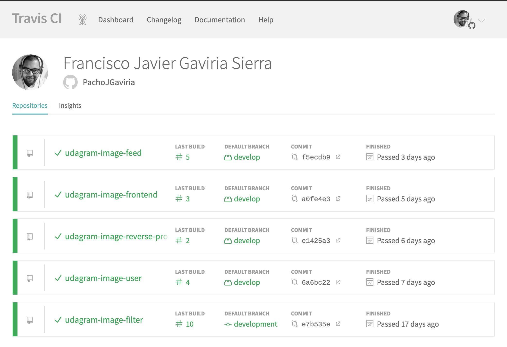

*******

## K8s logs

- **[kubectl get logs output](./logs/user.log.md)**

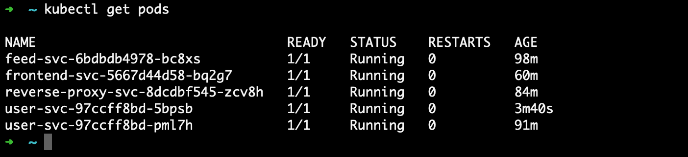
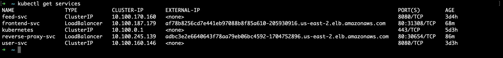
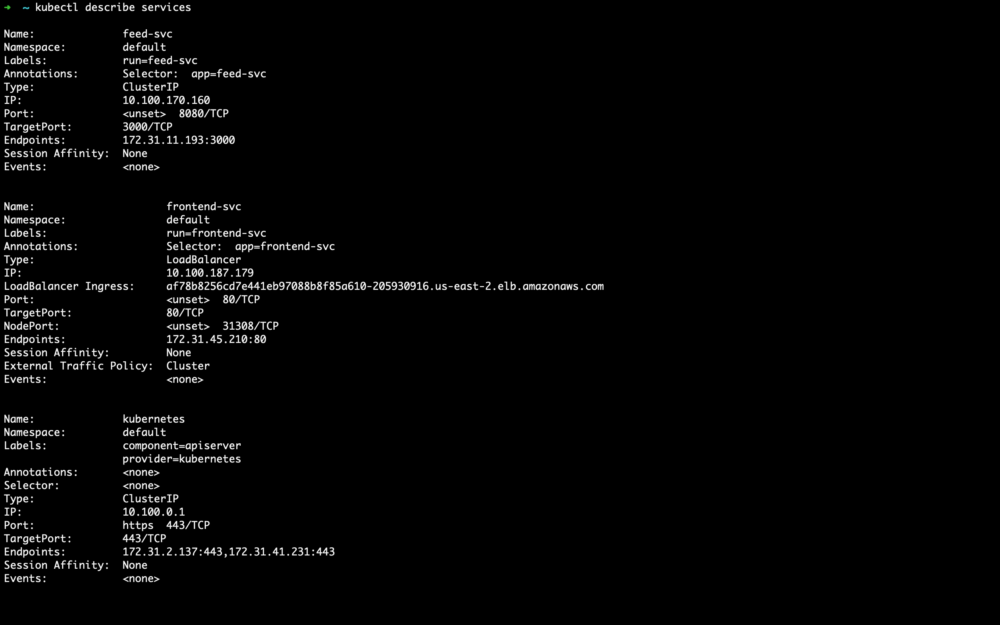
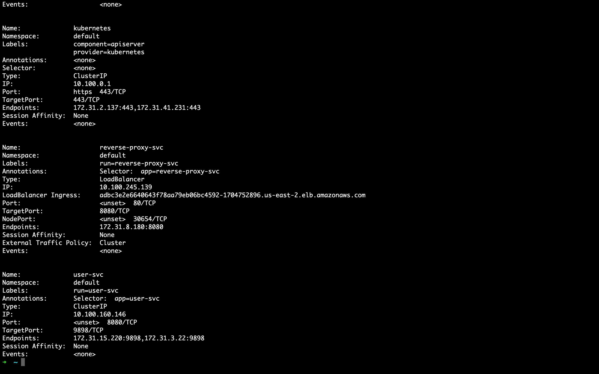
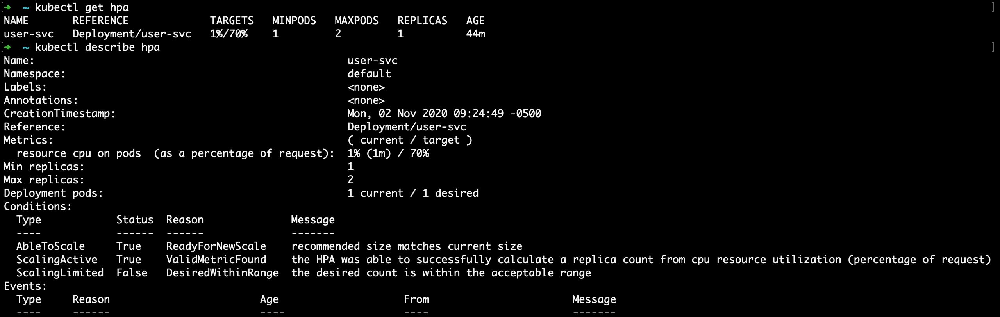
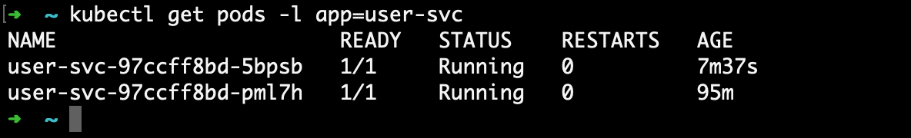
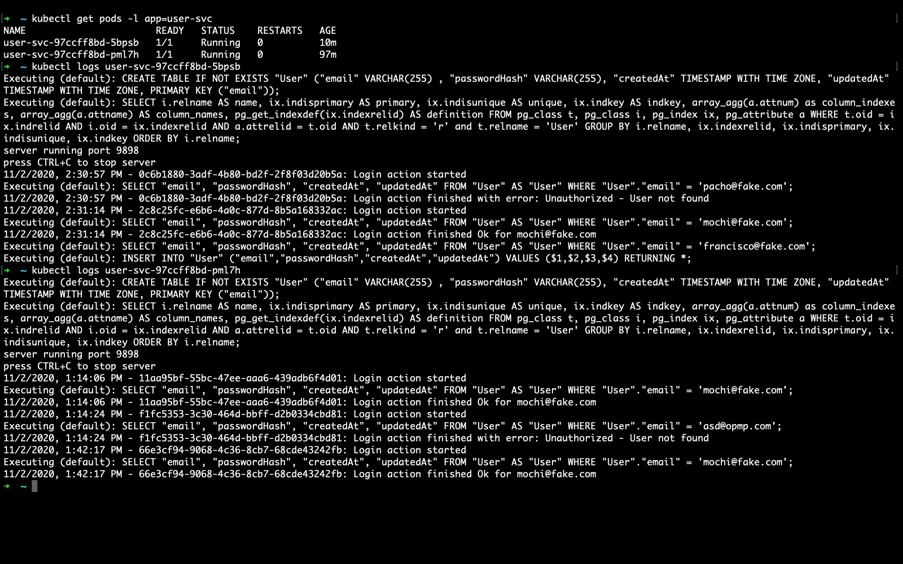

*******

## Public URL`s

- **[Frontend App public URL](http://af78b8256cd7e441eb97088b8f85a610-205930916.us-east-2.elb.amazonaws.com)**
- **[Reverse-proxy App public URL](http://adbc3e2e6640643f78aa79eb06bc4592-1704752896.us-east-2.elb.amazonaws.com)**

*******

## Architecture

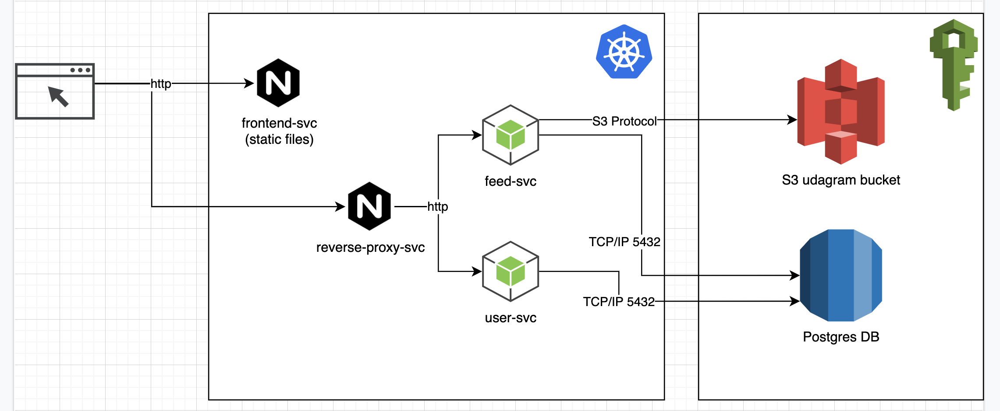

